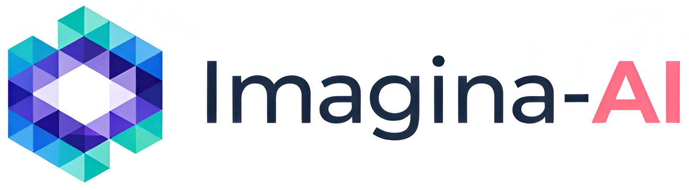

# Imagina AI

Streamlit studio for generating cinematic videos from a theme or structured script. Supports OpenAI Sora, Gemini (VEO), and FastWan video generation, Kokoro TTS voiceovers, optional Sync lip-sync, and built-in tools for trimming, watermark removal, and YouTube downloads.



## Features

- Cinematic generator: create beats via GPT or upload SRT-style blocks, generate scene images and videos (Sora/Gemini/FastWan), then merge into a final render.
- Audio + lip-sync: Kokoro TTS voices with selectable speakers, speed, and optional custom BGM; Sync-driven lip-sync for custom audio using a temporary static file server.
- Media utilities: watermark remover (OpenCV inpainting or FFmpeg delogo), media trimmer, video merger, and YouTube downloader (audio/video/both) powered by ffmpeg and yt-dlp.
- Output controls: choose aspect ratios/resolutions, toggle watermark/logo, provide reference images, regenerate scenes, and pick download quality.
- Logging: rotating app logs in `logs/app.log`; temp assets are written to the system temp directory.

## Requirements

- Python 3.10+
- `ffmpeg` on PATH
- `yt-dlp` on PATH (YouTube tab)
- (Recommended) GPU for faster image/video generation; FastWan requires a capable GPU

## Setup

```bash
python -m venv .venv
# Windows
.venv\Scripts\activate
# macOS/Linux
source .venv/bin/activate

pip install -r requirements.txt
```

### Environment (.env)

Create `.env` in the repo root:

```env
OPENAI_API_KEY=sk-...           # GPT prompts + Sora video generation
GOOGLE_GENAI_API_KEY=...        # Gemini/VEO workflows
SYNC_API_KEY=...                # Lip-sync via syncsdk

BASE_URL=http://localhost:8000  # Base URL for the static file server
STATIC_SERVER_PORT=8000         # Port for the static server
USE_NGROK=true                  # Set false to skip ngrok tunneling
NGROK_AUTH_TOKEN=...            # Optional, if using ngrok
```

Logos/watermarks live in `images/`; update paths there if you swap assets.

## Running

```bash
# optional: serve temp files for lip-sync/static access
uvicorn core.static_file_serve_api:app --host 0.0.0.0 --port 8000

# Streamlit UI
streamlit run app.py --server.address 0.0.0.0 --server.port 8004 --server.enableCORS false
```

## Usage

- Cinematic Generator  
  1) Choose model (SORA/OpenAI, VEO/Gemini, or FastWan), language, duration, dimensions, and download resolution.  
  2) Generate a script from a theme or paste/upload a custom SRT-style script (see format below).  
  3) Optionally upload up to 3 reference images, enable custom audio with Kokoro speaker/speed/BGM, and toggle watermark/logo.  
  4) Click **Generate Scenes (and Audio)** to build per-scene assets; review/regenerate in the gallery.  
  5) Click **Generate Final Video** to merge scenes; enable lip-sync if using custom audio (requires the static server and reachable BASE_URL/ngrok URL).
- Merge Videos: concatenate clips via ffmpeg.
- Watermark Remover: select a region and choose OpenCV inpainting (higher quality) or FFmpeg delogo (faster).
- Media Trimmer: pick a time window, preview, trim, and download.
- YouTube Downloader: download audio, video-only, hybrid, or both via `yt-dlp`.

### Custom Script Format (paste/upload)

Each block uses SRT timestamps and tagged fields:

```txt
00:00:00,000 --> 00:00:05,000
[script]: "Line of narration in your chosen language"
[scene]: "English image description for this beat"
[video_scene]: "English motion/camera direction for the video model"
```

Blocks must be contiguous (end time of block N equals start time of block N+1), and total duration must not exceed the global duration you set.

## Project Layout

- `app.py` - Streamlit UI and tab workflows.
- `core/utils.py` - script parsing, GPT prompt flows, Kokoro TTS, scene image/video generation (Sora/Gemini), merging, watermark tools, and lip-sync wiring.
- `core/config.py` - model options, dimensions, resolutions, speaker list, and language codes.
- `core/yt_downloader_utils.py` - yt-dlp plus ffmpeg helpers.
- `core/trimmer_utils.py` - trim and preview helpers.
- `core/static_file_serve_api.py` - FastAPI static server with optional ngrok tunnel.
- `core/kokoro_tts_utils.py` - Kokoro TTS pipeline wrapper.
- `images/` - logos and default watermark.
- `logs/` - rotating application logs.

## Troubleshooting

- `ffmpeg` or `yt-dlp` not found: install and ensure they are on PATH.
- Lip-sync fails: confirm `BASE_URL` points to the static server or ngrok URL, and `SYNC_API_KEY` is set.
- Generation stalls: check API keys, GPU availability, and console logs; long runs can take time.
- YouTube downloads error: prefer `yt-dlp` (not `youtube-dl`) and update it regularly.

## Contributing

See [CONTRIBUTING.md](CONTRIBUTING.md) for development workflow and PR expectations. Please include repro steps and logs when filing issues.

## License

MIT - see [LICENSE](LICENSE).
