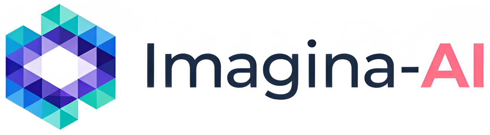

# Imagina AI



Theme-to-cinematic-video generator. Type a theme, get back a fully scored short film: LLM-written script → cinematic stills → per-scene video → TTS → optional lip-sync → final ffmpeg merge with watermark and logo.

Provider-agnostic by design. Every modality (script, image, video, lip-sync, TTS) ships with three interchangeable backends — local OSS, cloud-hosted OSS, and proprietary API — and the user picks the tier per-modality from the sidebar.

## Highlights

- **Three tiers per modality.** Local (M2-friendly) → Cloud OSS (Replicate) → API (OpenAI / Gemini / Sync.so / ElevenLabs). Switch any one without touching code; the registry handles fallback when env vars aren't set.
- **Single source of model selection.** Sidebar tier-picker writes to `st.session_state.preferred_models[modality]`; the registry honours it. No hidden coupling between "Model Type" and backend choice.
- **Worker / web split.** A FastAPI daemon (`worker/`) holds every model call so heavy weights (MLX, Z-Image, LTX) stay loaded across Streamlit reruns and long video generations don't freeze the UI thread.
- **Phase-aware memory management.** The worker preloads the auto-picked LLM at startup; pipelines call `worker.evict_models(modality=...)` at phase boundaries so MLX + diffusers don't fight for the same 16 GB. Eviction does the GPU cache drain (MPS / CUDA / MLX) so memory actually returns to the OS.
- **Model-aware UI.** Duration slider min/max/step is read from the active video backend. Dimension dropdown is the intersection of supported dimensions across the active image + video backends. TTS speed is pre-estimated from script length so the synthesised audio lands close to the scene duration on the first call.
- **Five built-in tools.** Cinematic Generator (the main flow), plus Merge, Watermark Remove, Media Trim, YouTube Download tabs.

## Quickstart

```bash
git clone https://github.com/himanshumahajan138/Imagina-AI.git && cd Imagina-AI
python -m venv venv && source venv/bin/activate
pip install -r requirements.txt
cp .env.example .env        # fill in at least one provider key (or use local backends only)

honcho start                # boots worker (:8005) + Streamlit (:8004)
```

Open <http://localhost:8004>. The sidebar warns if the worker isn't reachable.

Don't have honcho? Run them in two terminals:

```bash
uvicorn worker.main:app --port 8005 --reload
streamlit run app.py --server.port 8004
```

Local-only run (no provider keys needed):

```bash
# install the optional deps that local backends need
pip install -U torch diffusers transformers accelerate safetensors imageio imageio-ffmpeg
pip install mlx-lm                # Apple Silicon LLM (Qwen 2.5 7B Q4)
pip install onnxruntime-coreml    # Wav2Lip lipsync — also needs models/wav2lip.onnx
honcho start
```

## How model selection works

`configs/models.yaml` is the source of truth — every backend the system can use is declared there with its tier, env requirements, and per-model metadata (scene duration, supported dimensions, etc.).

When the sidebar's tier picker is left on **Auto**, the registry picks the highest tier whose env vars are satisfied: API → Cloud OSS → Local. Override per-modality from the **🎚️ Model Selection (advanced)** expander. Stub backends and ones whose env isn't set are flagged in the dropdown but stay user-selectable.

```yaml
# configs/models.yaml — excerpt
image:
  models:
    z-image-turbo:               # local default
      tier: local
      backend: zimage_local
      hf_id: Tongyi-MAI/Z-Image-Turbo
      ram_gb: 12
      num_inference_steps: 9
      supported_dimensions: ["1024x1024", "1024x1536", "1536x1024"]
    flux-dev:
      tier: cloud_oss
      backend: replicate
      replicate_id: black-forest-labs/flux-dev
      requires_env: REPLICATE_API_TOKEN
    gpt-image-1:
      tier: api
      backend: openai
      requires_env: OPENAI_API_KEY
```

Per-model metadata that flows through to the UI / pipeline:

- `scene_duration` — per-scene clip length the video backend emits (8 for VEO 3, 12 for Sora, 10 for OSS).
- `supported_dimensions` — restricts the sidebar dropdown to a model's actual capability.
- `produces_audio` — set on VEO 3; the pipeline skips lip-sync when the video backend already produces synced audio.
- `unavailable: true` — marks a backend as a stub. Auto-pick skips it; user can still select it from the sidebar.
- `requires_env` — env var(s) needed; `BackendUnavailable` raised with a helpful message if missing.

## Architecture

```txt
┌──────────────────────────┐         HTTP            ┌──────────────────────────┐
│  Streamlit (app.py)      │  ─────────────────────► │  imagina-worker          │
│  ─ ui/sidebar.py         │   POST /scripts/gen     │  (FastAPI on :8005)      │
│  ─ ui/tabs/cinematic.py  │   POST /images/gen ──┐  │                          │
│  ─ pipelines/cinematic.py│   POST /videos/gen ──┤  │  ─ services/llm/*        │
│      └─ worker_client    │   POST /lipsync/apply┤  │  ─ services/image/*      │
│                          │   GET  /jobs/{id} ◄──┘  │  ─ services/video/*      │
│  + ffmpeg merge          │   POST /tts/synthesize  │  ─ services/tts/*        │
│  + watermark/logo        │   POST /models/evict    │  ─ services/lipsync/*    │
│  + audio time-stretch    │   GET  /models/resident │  ─ core/model_manager    │
└──────────────────────────┘                         └──────────────────────────┘
        shared filesystem: /tmp/imagina/<job_id>/...
```

**Streamlit owns** UI, ffmpeg merging, watermark/logo overlay, BGM mixing, audio duration adjustment. **Worker owns** every model call. See [docs/worker-service.md](docs/worker-service.md) for the design rationale.

## Project layout

```text
app.py                     Streamlit entry point
configs/models.yaml        Model registry — single source of truth

core/
  registry.py              Model selection + tier fallback + dimension intersection
  protocols.py             Backend protocols (LLMBackend, ImageBackend, …)
  worker_client.py         HTTP client used by pipelines (mirrors service-facade APIs)
  worker_config.py         IMAGINA_WORKER_URL + timeout knobs
  model_manager.py         Lazy load + eviction + GPU-cache drain for local weights
  types.py                 Shared dataclasses (MediaAsset, Script, Tier)

services/<modality>/
  service.py               Facade — picks model, loads backend module, calls it
  backends/<name>.py       One adapter per provider; implements the protocol

pipelines/cinematic.py     Theme → script → image → video → tts → merge orchestrator

worker/                    FastAPI daemon
  main.py                  app factory + uvicorn entrypoint, startup LLM warmup
  schemas.py               Pydantic request/response shapes
  jobs.py                  In-process async job manager (ThreadPoolExecutor)
  routes/                  one file per endpoint

ui/                        Streamlit UI (sidebar + tabs + reusable components)
server/static.py           Static file server (used by Sync.so lip-sync for URLs)
docs/worker-service.md     Worker daemon design doc
Procfile                   honcho process map (worker + web)
```

## Provider matrix

| Modality | Local | Cloud OSS | API |
| --- | --- | --- | --- |
| **LLM (script)** | Qwen 2.5 7B Q4 (MLX) | DeepSeek V3 (Replicate) | Gemini, GPT |
| **Image** | **SDXL-Turbo (default, ~7 GB)**, Z-Image-Turbo (Tongyi-MAI, ~33 GB on disk, top quality) | FLUX.1-dev (Replicate) | Imagen 4, gpt-image-1 |
| **Video** | LTX-Video 2B (diffusers + MPS) | Wan 2.1, HunyuanVideo (Replicate) | VEO 3, Sora |
| **Lip-sync** | Wav2Lip (ONNX + Core ML EP) | LatentSync (Replicate) | Sync.so |
| **TTS** | Kokoro | F5-TTS (Replicate) | ElevenLabs |

All five modalities have a working local-tier auto-pick. Local backends raise `BackendUnavailable` with an actionable message if their optional deps aren't installed (e.g. "run `pip install onnxruntime-coreml`"), so the registry falls through cleanly.

## Configuration

### Provider keys (`.env`)

```bash
OPENAI_API_KEY=sk-…           # for gpt-image-1, Sora, GPT script
GOOGLE_GENAI_API_KEY=…        # for Gemini, Imagen, VEO 3
REPLICATE_API_TOKEN=r8_…      # for any cloud_oss tier
SYNC_API_KEY=…                # for Sync.so lip-sync
ELEVENLABS_API_KEY=…          # for ElevenLabs TTS

# Sync.so needs publicly-reachable URLs for video/audio uploads:
BASE_URL=http://localhost:8000
STATIC_SERVER_PORT=8000
USE_NGROK=false
NGROK_AUTH_TOKEN=
```

### Worker daemon

| Var | Default | Purpose |
| --- | --- | --- |
| `IMAGINA_WORKER_URL` | `http://127.0.0.1:8005` | Where the Streamlit app reaches the worker |
| `IMAGINA_WORKER_PORT` | `8005` | Port the worker binds to |
| `IMAGINA_WORKER_TMP` | `/tmp/imagina` | Worker's scratch dir |
| `IMAGINA_WORKER_SYNC_TIMEOUT` | `600` | HTTP timeout for sync endpoints — covers cold MLX / Kokoro loads |
| `IMAGINA_WORKER_POLL_INTERVAL` | `5` | Async-job poll cadence (s) |
| `IMAGINA_WORKER_JOB_TIMEOUT` | `1800` | Hard cap on a single async job (s) |
| `IMAGINA_PRELOAD_LLM` | `true` | Background warmup of the auto-picked LLM at worker startup |

## Adding a new backend

**1.** Drop a file in `services/<modality>/backends/<name>.py` that implements the matching protocol from `core/protocols.py` and exports `build_backend(cfg) -> <Modality>Backend`.

**2.** Add an entry to `configs/models.yaml`:

```yaml
image:
  models:
    my-new-model:
      tier: api          # or cloud_oss / local
      backend: my_name   # = filename without .py
      requires_env: MY_API_KEY
      supported_dimensions: ["1024x1024"]   # optional
```

**3.** That's it. No registry edits, no pipeline edits, no UI edits. The sidebar tier picker discovers it automatically; the worker routes it via the existing `*Service(model_id=...)` constructors.

For local backends that hold heavy weights, also implement `warmup()` so the worker's startup preload + `model_manager` cache work. Use a unique cache-key prefix (`mlx::`, `diffusers::`, `kokoro::`, `ltx::`, `wav2lip::`) and add it to `_MODALITY_PREFIXES` in `core/model_manager.py` so `evict_modality()` can target it.

## Worker HTTP API

| Method | Path | Purpose |
| --- | --- | --- |
| `GET` | `/health` | Liveness + per-modality auto-pick |
| `GET` | `/models` | Full registry dump |
| `GET` | `/models/resident` | Currently-loaded model cache snapshot |
| `POST` | `/models/evict` | Drop loaded weights (`{modality, key, all}` body) |
| `POST` | `/scripts/generate` | Sync — LLM script |
| `POST` | `/tts/synthesize` | Sync — one audio segment |
| `POST` | `/images/generate` | Async (`202 → job_id`) — first-run weight downloads can take minutes |
| `POST` | `/videos/generate` | Async (`202 → job_id`) |
| `POST` | `/lipsync/apply` | Async (`202 → job_id`) |
| `GET` | `/jobs/{job_id}` | Poll status / fetch result |
| `DELETE` | `/jobs/{job_id}` | Best-effort cancel |

OpenAPI / Swagger UI lives at <http://localhost:8005/docs> when the worker is running.

## Memory management on M2 16 GB

The worker tracks resident model weights with a per-process LRU and a configurable RAM budget (default 12 GB). On a tight box, two heavy models won't fit simultaneously — Z-Image-Turbo is ~12 GB, MLX Qwen is ~6 GB, LTX-Video is ~12 GB peak. Two strategies handle this:

1. **Phase-aware eviction.** Pipelines call `worker.evict_models(modality="llm")` after script gen, `evict_models(modality="image")` after the per-scene image loop, etc. Each call does `del` + `gc.collect()` + `torch.mps.empty_cache()` + `mlx.clear_cache()` so memory actually returns to the OS — without the cache drain, `del` alone leaves the GPU allocator pool resident.
2. **LRU under budget pressure.** If a request asks for a model that doesn't fit (e.g. you switch from MLX to Z-Image), the manager evicts the least-recently-used weights to make room before loading.

A typical cinematic run looks like:

```text
worker startup → preload Qwen 2.5 in background (~30s, non-blocking)
script gen     → Qwen warm, ~5s/script
evict("llm")   → Qwen freed (~6 GB returned)
audio gen      → Kokoro loaded (~1 GB), ~2-5s/scene
image gen      → Z-Image loaded (~12 GB), ~10s/scene after first download
evict("image") → Z-Image freed
evict("tts")   → Kokoro freed
video gen      → LTX or cloud video backend, ~3-6 min/scene local / ~30s/scene cloud
evict("video") → freed
lipsync + merge (Streamlit-side ffmpeg)
```

`IMAGINA_PRELOAD_LLM=false` if you want to skip the startup warmup (e.g. when iterating on the worker without using the LLM).

## Local backend details

| Backend | File | Optional deps | Notes |
| --- | --- | --- | --- |
| `mlx_local` (LLM) | `services/llm/backends/mlx_local.py` | `pip install mlx-lm` | Apple Silicon only; Qwen 2.5 7B Q4 |
| `coreml_local` (image, default) | `services/image/backends/coreml_local.py` | `pip install -U torch diffusers transformers accelerate safetensors` | SDXL-Turbo via diffusers + MPS; defaults to 4 inference steps for better quality (~25s/image vs ~8s at 1-step). Tunables: `num_inference_steps`, `guidance_scale`, optional `vae_id` swap (e.g. `madebyollin/sdxl-vae-fp16-fix`). Despite the filename it's diffusers, not Apple Core ML |
| `zimage_local` (image, alternative) | `services/image/backends/zimage_local.py` | same | Tongyi-MAI Z-Image-Turbo. 6B param S3-DiT, 8-step distilled, bf16. Best quality but ~33 GB on disk |
| `ltx_local` (video) | `services/video/backends/ltx_local.py` | + `imageio imageio-ffmpeg` | LTX-Video 2B image-to-video, ~3-6 min/clip on M2 |
| `kokoro_local` (TTS) | `services/tts/backends/kokoro_local.py` | bundled in core deps | American/British/multilingual voices |
| `wav2lip_local` (lipsync) | `services/lipsync/backends/wav2lip_local.py` | `pip install onnxruntime-coreml` + `models/wav2lip.onnx` | OpenCV face detect + librosa mel + ONNX inference + ffmpeg mux |

First run downloads model weights to `~/.cache/huggingface/`. Disk and runtime RAM are different — `torch_dtype=bfloat16` halves the in-memory cost but doesn't shrink the on-disk weights, since these repos ship fp32 master weights without a bf16 variant.

| Model | On disk | Runtime RAM (bf16) |
| --- | --- | --- |
| Z-Image-Turbo | ~33 GB | ~12 GB |
| SDXL-Turbo | ~7 GB | ~8 GB |
| LTX-Video 2B | ~10 GB | ~12 GB peak |
| Qwen 2.5 7B Q4 (MLX) | ~4 GB | ~6 GB |
| Kokoro | ~1 GB | ~1 GB |

Pre-warm Z-Image manually if you don't want the first scene's image gen to sit on a download:

```python
from diffusers import ZImagePipeline; import torch
ZImagePipeline.from_pretrained("Tongyi-MAI/Z-Image-Turbo", torch_dtype=torch.bfloat16, use_safetensors=True)
```

## Audio duration alignment

Each scene's TTS audio is guaranteed to land at exactly the active video backend's `scene_duration` (8s for VEO 3, 12s for Sora, 10s elsewhere). Two-stage:

1. **Pre-estimate** TTS speed from `len(text.split())` and target duration (centred on ~2.4 wps); pass to `worker.synthesize(speed=...)`. The TTS engine produces close-to-target audio on the first call, no retry loop needed.
2. **Post-fit** with a simple rule: if the result is short, append silence; if long, run pydub's pitch-preserving `speedup`. Final audio is exactly the target duration to the millisecond.

Net result: the merged audio track lines up frame-perfectly with the video track, no drift across scenes.

## License

TBD.
